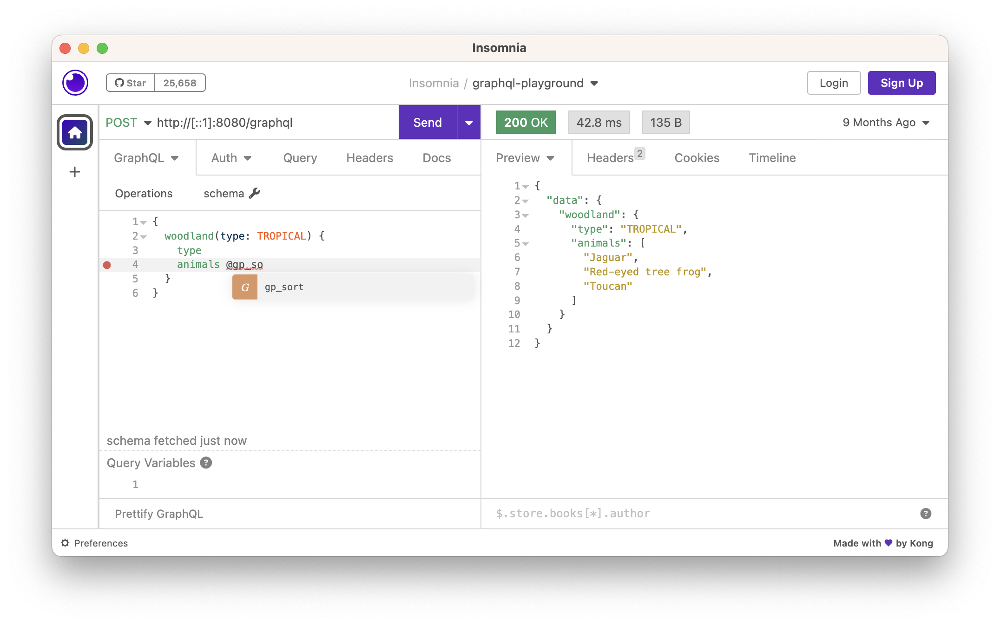

# custom-directives

An advanced GraphQL Java example program that defines and implements custom directives like `@gp_uppercase` and `@gp_sort` using
a bespoke ExecutionStrategy. It also uses a web server and demonstrates GraphiQL.


## Description

GraphQL has a neat feature called [_directives_](https://graphql.org/learn/queries/#directives). You should read the
official docs to begin your learning journey with GraphQL directives. Don't be afraid to read the GraphQL specification
itself! Section [3.13 Directives](https://spec.graphql.org/October2021/#sec-Type-System.Directives) describes directives
in clear detail.

Custom directives can be defined for use in the schema, in queries, or both! In this project, we define a directive that
can be used in queries for upper-casing strings: `@gp_uppercase`. Per convention, the directive is given a custom prefix
ending in `_` so that users can distinguish it from standard built-in directives like `@skip` and `@include`. In this
case, `gp` is the acronym for `graphql-playground.`

The project also defines a `@gp_sort` directive for sorting lists.


## Instructions

Follow these instructions to build and run the app:

1. Pre-requisite: Java 21, Node v20.x
2. Build the program distribution:
    * ```bash
      ./gradlew :server:installDist
      ```
3. Run the GraphQL server:
    * ```bash
      ./server/build/install/server/bin/server
      ```
4. Make a query:
    * ```bash
      curl http://127.0.0.1:8080/graphql --header "Content-Type:application/graphql" --data ' 
      {
        woodland(type: TROPICAL) {
          type
          animals @gp_uppercase
        }
      }'
      ```
    * You should notice that a list of three tropical rainforest animals was printed to the screen and they are all
      upper-cased! It should look something like the following.
    * ```json
      {
        "data" : {
          "woodland" : {
            "type" : "TROPICAL",
            "animals" : [ "JAGUAR", "TOUCAN", "RED-EYED TREE FROG" ]
          }
        }
      }
      ```
5. Try making a request from [Insomnia](https://insomnia.rest/) for happier development:
    * For example, try the following request that uses the `@gp_sort` directive:
    * 
    * Notice how Insomnia offers an auto-completion suggestion to complete `@gp_sort`. This makes it easy to write
      queries! 
    * Next, experiment with combinations of the custom directives.
    * ```graphql
      {
        woodland(type: DESERT) {
          animals @gp_sort(order: DESC)
        }
      }
      ```
6. Build and serve GraphiQL, an in-browser GraphQL explorer
    * GraphiQL is served by a React-based web project defined in part by the `package.json` file and the HTML and TypeScript
      code in the `ui/` directory. Follow the next steps to build the program and serve it.
7. Install the dependencies
    * ```bash
      npm install
      ```
8. Serve the content (and build continuously)
    * ```bash
      npm start
      ```
9. Open the browser
   * Open <http://[::1]:8000>
10. Try another query
    * Copy and paste from the earlier examples or make your own query. Click the big play button in the top-left corner
      to execute a request:
    * 

Tip: to start the program in Java's debug mode, set the following environment variable:
* `export CUSTOM_DIRECTIVES_OPTS=-agentlib:jdwp=transport=dt_socket,server=y,suspend=y,address=*:5005`


## Wish List

General clean-ups, TODOs and things I wish to implement for this project:

* [x] DONE Genericize the implementation of `@gp_uppercase`. Can it be done somewhere else in the GraphQL Java machinery? I
  suppose it could be done in a base class that extends DataFetchers, but that's not great. It could be done in GraphQL's
  instrumentation layer, but that's quite low-level, and designed for metrics. Is there somewhere else? I can't find
  anything in the GraphQL Java docs for query directives, only [schema directives](https://www.graphql-java.com/documentation/sdl-directives).
  So maybe this isn't supported in a "paved road" way, but this library is so extensible I think there's a way.
  * Update: I think instrumentation is the way to go. The type hierarchy of GraphQL's "execution machinery" is thick and
    complicated. It is a true framework. I'll say it again, GraphQL Java is a framework, not a library! Looking at the
    code in the classes `graphql.GraphQL`, `graphql.execution.AsyncExecutionStrategy`, and `graphql.execution.Execution`
    make me realize the framework qualities of GraphQL Java. That said, I think it's really well done and I could
    probably digest and understand the codebase without too much of a hassle, but still, it is circuitous so I'll pass
    for now. Instead I'll focus on the public interfaces, like `graphql.execution.instrumentation.Instrumentation` which
    the authors of the framework intend for users to use directly.
  * Update 2: Now I've changed my mind again and think extending the `ExecutionStrategy` is the right move. It has
    protected methods `graphql.execution.ExecutionStrategy.completeValue` and `graphql.execution.ExecutionStrategy.completeValueForList`
    which return a `graphql.execution.FieldValueInfo` instance which is marked as `@PublicApi`. The combination of `protected`
    methods and a public API class are an indicator that this is a blessed extension point in the framework.
* [x] DONE Create a sort directive
* Create a limit directive (and remove the `animalCount` param)
* [x] DONE Make more forests sample data. Actually, expand it to all [woodlands](https://en.wikipedia.org/wiki/Woodland)?
* [x] DONE (I didn't separate graphql-util from gd-directivees. That would be useful if I fleshed out more machinery around the pattern but not sure that's worth it for this playground). Split out into multiple sub-projects: 1) graphql-util 2) gp-directives 3) forests, 4) cli
* [x] DONE (that was nice and easy) Use a secondary schema file for the gp-directives, separate from the woodlands/cli schema? Is this possible?
  * Update: reference the ["Modularizing the Schema SDL" section in the docs](https://www.graphql-java.com/documentation/schema)  
* [x] DONE Make it a web project instead of a CLI project so that I can demo the usage from Insomnia. This makes for
  a great demo because of Insomnia's built-in support for GraphQL. It fetches the schema and does auto-complete! Much
  more interesting than a CLI (but the CLI is a good vehicle for basic demos).
* [x] DONE Split out the GraphQL schema file and runtime wiring code into a new module named `graphql/`.
* [x] DONE Add a front-end project that serves GraphiQL (an in-browser GraphQL explorer, as opposed to Insomnia). This is a
  very large addition to this project, but the `custom-directives/` project is after all an advanced example. 


## Reference

* [graphql-java GitHub issue #1201](https://github.com/graphql-java/graphql-java/issues/1201)
  * This GitHub issue contains relevant discussion about GraphQL Java's ability to implement directives for `FIELD`
    targets and why that is different from implementing directives for `FIELD_DEFINITION` targets. The GitHub issue
    discussion doesn't spell it out that clearly, but you should read if interested in GraphQL Java official advice for
    implementing directives. GraphQL Java has a really nice way to define `FIELD_DEFINITION` directives, like the `@auth`
    example in the docs. By contrast, the `graphql-playground/custom-directives` subproject shows how to define `FIELD`
    directives which can be applied by end-users of the GraphQL API, where for example, they might want to uppercase
    one field of dozens returned in the response. We don't know where the end-user will use the the `@gp_uppercase`
    directive. 
* [GraphiQL docs](https://github.com/graphql/graphiql/tree/main/packages/graphiql)
* [GitHub repo `reach/reach-ui` issue #916: *Compatibility with React 18*](https://github.com/reach/reach-ui/issues/916)
  * Unfortunately, the latest version of GraphiQL (2.2.0) which by many accounts is modernized (hooray for the 2.0 release
    in Summer 2022) has a transitive peer dependency restriction on React 17 but not later. This is unfortunate because
    React has been out since March 2022. The GraphiQL [official example apps even continue to declare a dependency on React 17](https://github.com/graphql/graphiql/blob/ab2b52f06213bd9bf90c905c1b460b6939f3d856/examples/graphiql-webpack/package.json#L18)
    and not React 18. I can afford to be patient, I don't want to outrun the safety of the GraphiQL support or else we're
    liable to be get burned.
